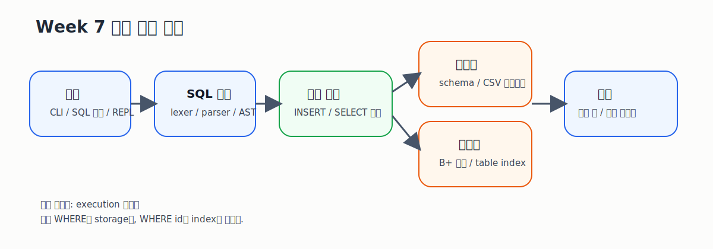
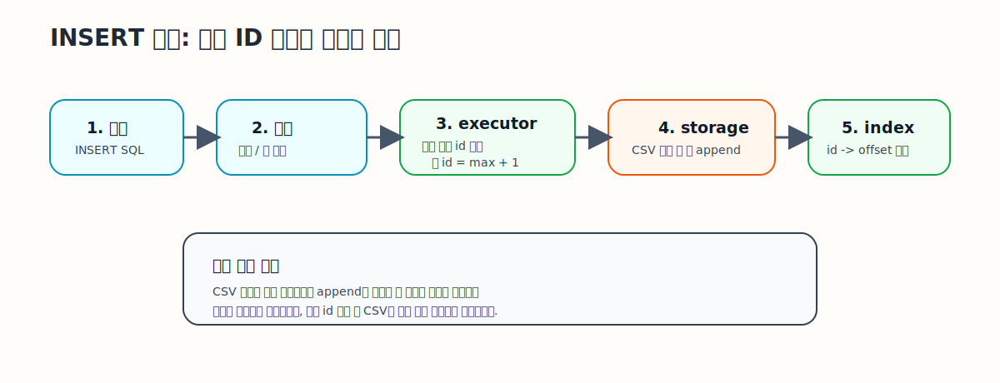
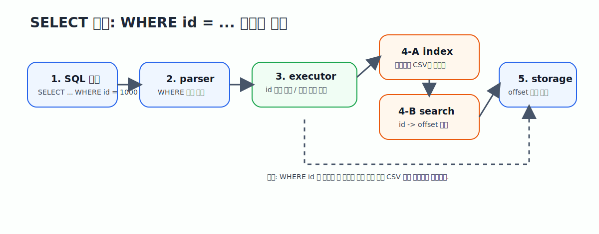

# SQL Processor Week 7

파일 기반 SQL 처리기에 `id` 자동 부여와 메모리 기반 B+ 트리 인덱스를 붙여, `WHERE id = ...` 조회를 최적화한 7주차 프로젝트입니다.

기준 문서는 [docs/architecture.md](/C:/developer_folder/jungle-sql-processor-2nd/docs/architecture.md)와 [docs/requirements.md](/C:/developer_folder/jungle-sql-processor-2nd/docs/requirements.md)입니다. 구현 설명은 이 README보다 두 문서를 우선합니다.

## 발표용 요약

### 문제 정의

6주차 SQL 처리기는 CSV를 선형 탐색하므로, 데이터가 커질수록 특정 레코드를 찾는 비용이 계속 커집니다.

7주차 목표는 아래 3가지였습니다.

- `INSERT` 시 레코드에 `id`를 자동 부여한다.
- `id`를 키로 사용하는 메모리 기반 B+ 트리를 만든다.
- `WHERE id = <number>` 조회는 인덱스를 사용하고, 다른 컬럼 조건은 기존 선형 탐색을 유지한다.

### 이번 주 핵심 구현

- 기존 `INSERT`, `SELECT`, `SELECT ... WHERE` 흐름 유지
- `id` 자동 부여
- 테이블별 메모리 B+ 트리 인덱스 유지
- `WHERE id = <number>` 인덱스 조회
- CSV 기준 인덱스 재구성
- 1,000,000건 이상 삽입 가능한 벤치마크 진입점 제공
- 단위 테스트 및 기능 테스트 작성

### 발표에서 보여줄 차별점

- 기존 SQL 처리기를 버리지 않고 그대로 확장했다는 점
- 일반 조회와 인덱스 조회가 코드 경로에서 명확히 분리된다는 점
- 테스트와 벤치마크를 함께 준비해 결과물뿐 아니라 검증 과정도 보여줄 수 있다는 점

## 시각 자료

### 1. 전체 구조



### 2. INSERT 시 자동 ID 부여와 인덱스 등록



### 3. `WHERE id = ...` 조회 시 인덱스 사용



## 프로젝트가 푸는 문제

CSV 기반 저장소는 구현이 단순하지만, 원하는 레코드를 찾으려면 보통 처음부터 끝까지 읽어야 합니다.

예를 들어 `student.csv`에 1,000,000건이 들어 있을 때:

- `WHERE name = '김민수'`는 선형 탐색이 필요합니다.
- `WHERE id = 500000`도 인덱스가 없으면 같은 선형 탐색입니다.

이번 구현에서는 `id` 기준 조회만이라도 빠르게 만들기 위해 B+ 트리를 붙였습니다.

## 핵심 아이디어

### 1. CSV는 계속 영속 저장의 기준이다

- 실제 데이터는 계속 `data/*.csv`에 저장합니다.
- 인덱스는 메모리 구조이므로, 필요하면 CSV를 다시 읽어 재구성합니다.

### 2. `id`는 시스템 관리 컬럼이다

- 사용자가 `INSERT`를 실행하면 시스템이 새 `id`를 계산합니다.
- 새 `id`는 현재 최대 `id + 1`입니다.

### 3. `WHERE id = ...`만 인덱스를 탄다

- `WHERE id = 1000`은 B+ 트리로 찾습니다.
- `WHERE department = '컴퓨터공학과'`는 기존 CSV 선형 탐색을 유지합니다.

이렇게 해야 기존 구조를 크게 깨지 않고 7주차 요구사항에 정확히 맞출 수 있습니다.

## 지원 기능

- `INSERT`
- `SELECT *`
- `SELECT column1, column2`
- `SELECT ... WHERE column = value`
- `WHERE id = <number>` 인덱스 조회
- `id` 자동 부여
- SQL 파일 실행
- SQL 문자열 직접 실행
- REPL 실행
- Docker/Linux 기준 빌드와 테스트
- 별도 벤치마크 바이너리

## 현재 제외 범위

- `UPDATE`
- `DELETE`
- `JOIN`
- `ORDER BY`
- `GROUP BY`
- 복합 `WHERE`
- 범위 검색 최적화
- 디스크 기반 B+ 트리

## 디렉터리 구조

- `src/app`
  CLI 입력, 파일 입력, REPL 시작점
- `src/sql`
  lexer, parser, AST
- `src/execution`
  `INSERT`/`SELECT` 실행 분기, `id` 자동 생성, 인덱스 경로 선택
- `src/storage`
  스키마 로딩, CSV 검증, CSV 읽기/쓰기, CSV 순회
- `src/index`
  B+ 트리와 테이블별 인덱스 관리
- `src/benchmark`
  대량 삽입 및 조회 성능 측정용 별도 진입점
- `tests`
  단위/기능 테스트
- `docs`
  요구사항, 아키텍처, 테스트 문서
- `learning-docs`
  초심자용 학습 문서

## 데이터 형식

테이블은 아래 두 파일이 모두 있어야 합니다.

- `schema/<storage_name>.meta`
- `data/<storage_name>.csv`

예시:

```txt
table=학생
columns=id,department,student_number,name,age
```

같은 테이블의 CSV 첫 줄은 아래와 같이 헤더를 가집니다.

```txt
id,department,student_number,name,age
```

현재 포함된 샘플 데이터는 아래입니다.

- [schema/student.meta](/C:/developer_folder/jungle-sql-processor-2nd/schema/student.meta)
- [data/student.csv](/C:/developer_folder/jungle-sql-processor-2nd/data/student.csv)

## SQL 동작 규칙

### INSERT

- 사용자는 `id`를 빼고 나머지 컬럼만 넣어도 됩니다.
- 최종 저장되는 `id`는 시스템이 자동으로 결정합니다.
- 새 `id`는 현재 테이블의 최대 `id + 1`입니다.
- 저장 성공 후 `id -> CSV 행 위치`가 메모리 B+ 트리에 등록됩니다.

예시:

```sql
INSERT INTO 학생 (department, student_number, name, age)
VALUES ('컴퓨터공학과', '2024001', '김민수', 20);
```

### SELECT

- 일반 `SELECT`와 일반 `WHERE`는 기존 CSV 선형 탐색을 사용합니다.
- `WHERE id = <number>`는 정수 검증 후 B+ 트리 인덱스를 사용합니다.
- `WHERE id = abc` 같은 입력은 오류입니다.

예시:

```sql
SELECT * FROM 학생;
SELECT name, age FROM 학생 WHERE department = '컴퓨터공학과';
SELECT * FROM 학생 WHERE id = 1000;
```

## 발표 시연 순서

### 1. 기본 조회

```bash
./build/bin/sqlparser -e "SELECT * FROM 학생;"
```

### 2. 자동 ID 부여 INSERT

```bash
./build/bin/sqlparser -e "INSERT INTO 학생 (department, student_number, name, age) VALUES ('컴퓨터공학과', '2024001', '김민수', 20);"
```

### 3. 인덱스 조회

```bash
./build/bin/sqlparser -e "SELECT * FROM 학생 WHERE id = 1;"
```

### 4. 일반 WHERE 조회

```bash
./build/bin/sqlparser -e "SELECT name FROM 학생 WHERE department = '컴퓨터공학과';"
```

### 5. 벤치마크 실행

```bash
./build/bin/benchmark_runner benchmark-workdir/schema benchmark-workdir/data student 1000000 100
```

## 빌드

Linux 또는 Docker 기준:

```bash
make all
```

테스트 바이너리:

```bash
make test
```

벤치마크 바이너리:

```bash
make benchmark
```

## CLI 사용법

도움말:

```bash
./build/bin/sqlparser --help
```

SQL 문자열 직접 실행:

```bash
./build/bin/sqlparser -e "SELECT * FROM 학생;"
```

출력 예시:

```text
+----+----------------+----------------+--------+-----+
| id | department     | student_number | name   | age |
+----+----------------+----------------+--------+-----+
| 1  | 컴퓨터공학과   | 2024001        | 김민수 | 20  |
+----+----------------+----------------+--------+-----+
```

SQL 파일 실행:

```bash
./build/bin/sqlparser -f path/to/query.sql
```

표준입력으로 실행:

```bash
echo "SELECT name FROM 학생;" | ./build/bin/sqlparser
```

REPL 실행:

```bash
./build/bin/sqlparser
```

REPL 종료 명령:

- `.exit`
- `.quit`
- `exit`
- `quit`

## Docker 사용 예시

이미지 빌드:

```bash
docker build -t jungle-sql-processor-test .
```

CLI 실행:

```bash
docker run --rm -it -v "C:/developer_folder/jungle-sql-processor-2nd:/workspace" -w /workspace jungle-sql-processor-test ./build/bin/sqlparser
```

테스트 실행:

```bash
docker run --rm -v "C:/developer_folder/jungle-sql-processor-2nd:/workspace" -w /workspace jungle-sql-processor-test bash scripts/docker-test.sh
```

## 테스트

현재 테스트 러너 기준:

- 상위 테스트 함수 `29개`
- assertion `339개`

실행:

```bash
bash scripts/docker-test.sh
```

또는:

```bash
make test
```

테스트 범위 요약:

- B+ 트리 기본 삽입/검색/분할
- `id` 자동 부여
- `WHERE id` 인덱스 경로
- 일반 `WHERE` 선형 탐색
- 인덱스 재구성 및 오류 복구
- CLI 경계값 및 오류 메시지
- 벤치마크 데이터 재생성

상세 목록은 [docs/test-cases.md](/C:/developer_folder/jungle-sql-processor-2nd/docs/test-cases.md)에 정리돼 있습니다.

## 벤치마크

벤치마크는 별도 바이너리로 실행합니다.

```bash
./build/bin/benchmark_runner <schema_dir> <data_dir> <table_name> <row_count> [query_repeat]
```

예시:

```bash
./build/bin/benchmark_runner benchmark-workdir/schema benchmark-workdir/data student 1000000 100
```

출력:

- 삽입한 행 수
- 전체 삽입 시간
- 반복 조회 횟수
- `WHERE id = ...` 인덱스 조회 평균 시간
- 일반 컬럼 `WHERE ...` 선형 조회 평균 시간

주의:

- 벤치마크는 시작 시 지정한 CSV를 헤더만 남기고 초기화한 뒤 같은 입력 파라미터로 같은 데이터셋을 다시 생성합니다.
- 실데이터를 보호하려면 기본 샘플인 `benchmark-workdir/schema`, `benchmark-workdir/data`에서 실행하는 것이 좋습니다.
- 기본 벤치마크 작업 디렉터리 샘플은 아래에 포함돼 있습니다.
  - [benchmark-workdir/schema/student.meta](/C:/developer_folder/jungle-sql-processor-2nd/benchmark-workdir/schema/student.meta)
  - [benchmark-workdir/data/student.csv](/C:/developer_folder/jungle-sql-processor-2nd/benchmark-workdir/data/student.csv)

## 이번 주 발표에서 강조할 포인트

- 이전 차수 코드를 버리지 않고 7주차 요구를 덧붙였는가
- `WHERE id` 경로만 인덱스를 타도록 책임 분리가 되어 있는가
- 벤치마크와 테스트를 통해 결과를 검증했는가
- 구현한 코드를 팀원이 직접 설명할 수 있는가

## 참고 문서

- [docs/requirements.md](/C:/developer_folder/jungle-sql-processor-2nd/docs/requirements.md)
- [docs/architecture.md](/C:/developer_folder/jungle-sql-processor-2nd/docs/architecture.md)
- [docs/test-cases.md](/C:/developer_folder/jungle-sql-processor-2nd/docs/test-cases.md)
- [learning-docs/beginner-guide.md](/C:/developer_folder/jungle-sql-processor-2nd/learning-docs/beginner-guide.md)
- [learning-docs/docker-basics-for-week7.md](/C:/developer_folder/jungle-sql-processor-2nd/learning-docs/docker-basics-for-week7.md)
- [learning-docs/makefile-basics-for-sql-processor.md](/C:/developer_folder/jungle-sql-processor-2nd/learning-docs/makefile-basics-for-sql-processor.md)
